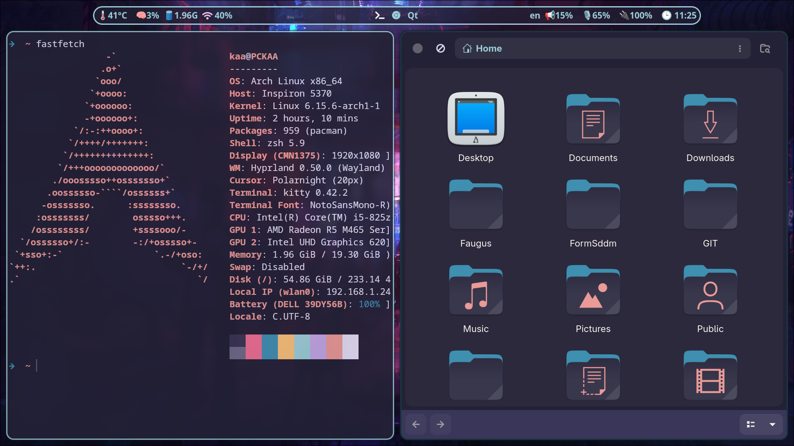
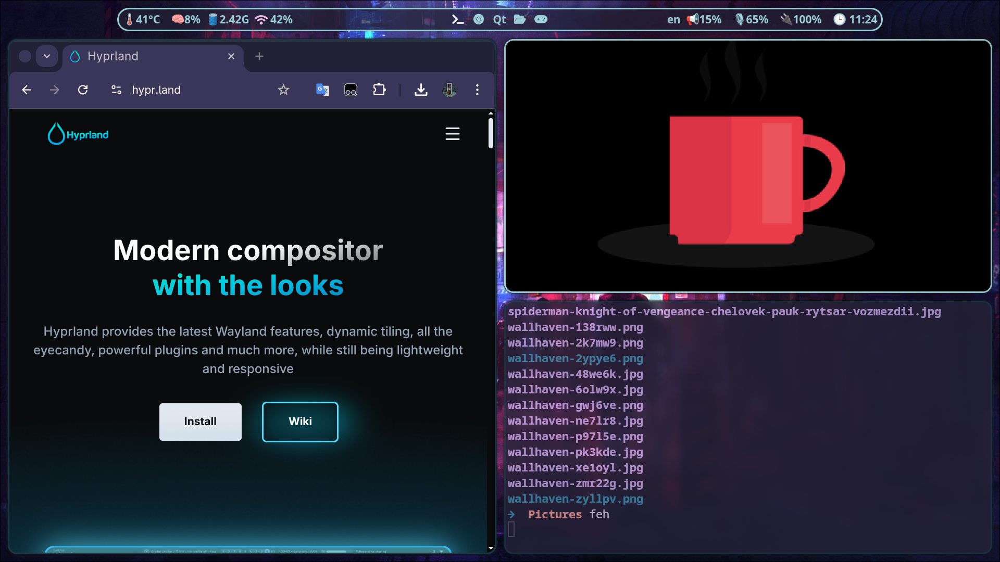
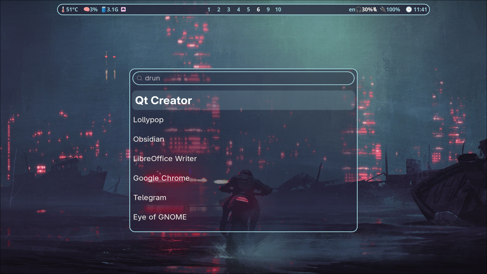

# 🐧 Arch Linux + Hyprland → Dot Files

Конфигурация рабочего окружения на Arch Linux с [Hyprland](https://github.com/hyprwm/Hyprland).

<p float="left">
    
     
    
    
</p>

## Состав системы
### Основные компоненты
- **ОС**: Arch Linux
- **Окружение**:
  - **Hyprland** – оконный менеджер
  - **Waybar** – панель состояния
  - **Wofi** – лаунчер приложений
  - **Kitty** – терминал
  - **Nautilus** – файловый менеджер

### Дополнительные модули
- **Gtklock** – автоматическая блокировка экрана
- **GDM** – графический менеджер входа
- **Пользовательские скрипты** – power-menu и другие
- **Тема оформления**: [Rose Pine GTK Theme](https://github.com/Fausto-Korpsvart/Rose-Pine-GTK-Theme)

## 🛠️ Установка
Перед установкой убедитесь, что установлены:
```bash
sudo pacman -S polkit dbus networkmanager pipewire wireplumber
```
Установите основные пакеты:
```bash
sudo pacman -S hyprland waybar wofi kitty nautilus grim slurp gtk3 gtk4
```
Копирование конфигураций:
```bash
git clone https://github.com/A92LEKSANDR/arch-hypr-dots.git
cp -r arch-hypr-dots/* ~/.config/
chmod +x ~/.config/hypr/scripts/*
```
### Дополнительно:
Автоблокировка и менеджер входа
```bash
sudo pacman -S gtklock gdm
sudo systemctl enable gdm.service
```
Установите GTK-тему:
```bash
git clone https://github.com/Fausto-Korpsvart/Rose-Pine-GTK-Theme
cd Rose-Pine-GTK-Theme
sudo cp -r Rose-Pine-GTK-Theme /usr/share/themes
```
##  Перезагрузка
После завершения настройки:
```bash
reboot
```
